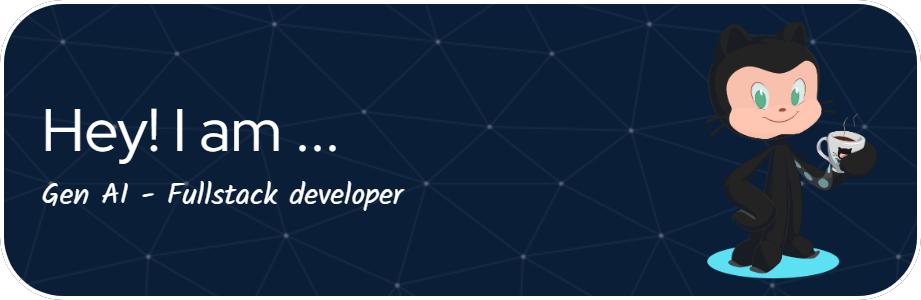

# 👋 Hi, I'm Viraj Mandlik

🎓 Computer Engineering Student at MIT Academy of Engineering | 💻 Full Stack Developer | 🌐 AWS Cloud Enthusiast

## 🚀 About Me:
- 🎥 I'm currently working on building full-stack applications with the MERN stack at Worqhat
- 👯 I'm looking to collaborate on open-source web development and cloud projects
- 💛 I'm looking for help with advanced cloud architecture and microservices design patterns
- 🌱 I'm currently learning Cloud Architecture, Microservices, and Advanced React Patterns
- 💬 Ask me about MERN Stack, AWS Cloud, and Data Structures & Algorithms
- ⚡ Fun fact: I've mentored over 100 students in DSA and Full Stack development as the President of 10X Club!

## 🛠️ Tech Stack
**Frontend**: React.js, JavaScript (ES6+), Tailwind CSS  
**Backend**: Node.js, Express.js, MongoDB, PostgreSQL  
**Cloud**: AWS (EC2, S3, IAM, CodeDeploy, CloudFormation), Vercel, Render  
**Tools**: Git, GitHub Actions, Postman, Docker  

## 🔥 Projects
- **JobTrack – Career Compass** - Full-stack job management platform with resume analytics
- **Sentify – AI Mental Health Detection** - Real-time AI-driven sentiment analysis app using IBM Cloud
- **Reportease – Department Report Automation** - System for automating departmental reports

## 🏆 Achievements
- Finalist — Smart India Hackathon 2024 (National Innovation Challenge)
- Runner-up — Cavista Hackathon 2025
- President — 10X Club (Coding Ninjas MITAOE)

## 📈 GitHub Stats

## 🔗 Connect With Me

---

⭐️ From [virajmandlik](https://github.com/virajmandlik)
